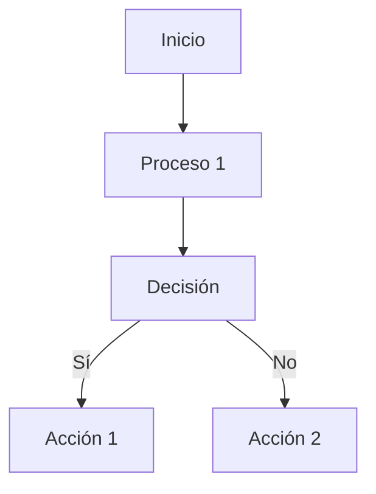

# 🌟 Guía Avanzada de Markdown 🚀

## 📌 Encabezados

# 🏆 Encabezado 1
## 🔥 Encabezado 2
### 🎯 Encabezado 3
#### 🎵 Encabezado 4
##### 🎭 Encabezado 5
###### 💡 Encabezado 6

## ✍️ Texto

**✨ Negrita ✨**  
*🌿 Itálica 🌿*  
~~🛑 Tachado 🛑~~  
`📜 Código en línea`

## 📜 Listas

### 🔹 Lista Desordenada
- ✅ Elemento 1
- 🔆 Elemento 2
  - 🎈 Sub-elemento 1
  - 🎀 Sub-elemento 2

### 🔢 Lista Ordenada
1. 🥇 Primer elemento
2. 🥈 Segundo elemento
   1. 🥉 Sub-elemento 1
   2. 🎖️ Sub-elemento 2

## 📊 Tablas

| 🎭 Nombre  | 🔢 Edad | 🌍 Ciudad  |
|-----------|------|---------|
| Juan      | 25   | 🏙️ Madrid |
| Ana       | 30   | 🌎 Lima   |
| Pedro     | 28   | 🏔️ Bogotá |

## 🖥️ Bloques de Código

```python
# 🐍 Código en Python
def hola():
    print("🌍 ¡Hola, mundo!")
```

```javascript
// 🚀 Código en JavaScript
console.log("🌍 ¡Hola, mundo!");
```

## 💬 Citas

> 🗣️ "Esto es una cita en Markdown."

## 🔗 Enlaces e Imágenes

[🔍 Enlace a Google](https://www.google.com)


## ✅ Checkbox

- [x] 🎯 Tarea completada
- [ ] 📌 Tarea pendiente
- [ ] 📅 Otra tarea pendiente

## 🎨 Línea Horizontal

---

## 🤩 Emoji

😃 🎉 🚀 💖 🔥 🎶 🏆 📚

## 🧮 Matemáticas (si está habilitado en el visor)

$$ E = mc^2 $$

## 🎮 Diagramas y Gráficos



## 🎼 Audio y Video

### 🎧 Insertar Audio

<audio controls>
  <source src="https://www.soundhelix.com/examples/mp3/SoundHelix-Song-1.mp3" type="audio/mpeg">
  Tu navegador no soporta el elemento de audio.
</audio>

### 📹 Insertar Video

<video width="320" height="240" controls>
  <source src="https://www.w3schools.com/html/mov_bbb.mp4" type="video/mp4">
  Tu navegador no soporta el elemento de video.
</video>

## 🎭 Resaltado de Texto

==Texto resaltado en amarillo==

## 🗂️ Detalles Colapsables

<details>
  <summary>Haz clic para expandir</summary>
  🎊 ¡Sorpresa! Aquí hay más información oculta.
</details>

## 🖍️ Código con Resaltado de Línea

```python {3}
def suma(a, b):
    resultado = a + b
    return resultado
```

---

✨ ¡Markdown es una herramienta increíble para documentación y notas rápidas! ✨
